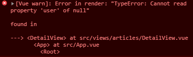
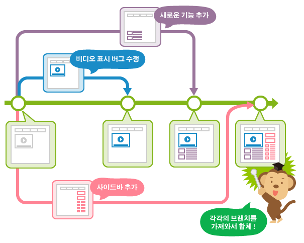

# 1. 1학기 관통프로젝트 배운점

영화 추천 사이트를 만드는 관통프로젝트를 진행하며 배운점을 기술한다.


## 1.1 django

> django에서 배운점

### 랜덤하게 select하기

`order_by`에 `'?'`를 인자로 넣으면 임의 순서로 select를 하게 된다. 이 때 인덱스 슬라이싱을 하면 select하고 싶은 갯수 또한 정할 수 있다.

```python
movies = Movie.objects.all().order_by('?')
```


### query_set 합치기

`union` 혹은 `|`를 사용하여 같은 모델의 query_set을 합칠 수 있다. (위의 방법으로 슬라이싱을 한 경우 합칠 수 없음에 주의하자)

```python
merge_movies = drama_movies | action_movies
```


### ManyToMany field 넣기

ManyToMany 필드의 경우, 추가하기위한 object를 만들고 내용을 채워 더해주어야 한다. 추가하기 전에 가 ManyToMany 필드가 아닌 다른 필드들을 넣고 `save()`해주어야 한다. (예제에서의 Movie와 Genre는 M:N관계이다)

```python
genre = Genre(name='드라마')
genre.save()
movie.genres.add(genre)
```


### fixtures 사용하기

fixture를 이용해 django의 DB를 json으로, json을 DB에 넣을 수 있다.

- DB -> json (dump)

```bash
$ python manage.py dumpdata {appname}.{modelname} --indent 2 > {fixturename}.json
# app내에 fixtures 폴더를 만들고 fixture를 넣어주도록 하자
```

- json -> DB (load)

```bash
$ python manage.py loaddate {loaddata} {appname}/fixtures/{fixturename}.json
```


### DB 데이터 삭제시 주의점

DB의 내용을 삭제하려면 각 app내의 `migrations`폴더를 `init.py`만을 남긴채 제거하고 `db.sqlite3`를 삭제해주면 된다. 하지만 가끔 데이터가 DB에서 **삭제되지 않는 경우**가 있는데, 대부분이 **서버를 돌리거나** (runserver) **shell_plus를 사용**하는 경우였다. 데이터를 삭제할 때는 위의 상황이 아닌지 체크하자.


## 1.2 vue

> vue에서 배운점

### axios 이후의 동작 주의점

axios로 요청을 보낸 후의 내용을 다음과 같이 코딩한적이 있다.

```js
axios.post(`${SERVER_URL}/survey`)
	.then(() => )
this.$router.push({ name: 'Home'})
```


위와 같이 코드를 작성했을 때 vue에서 백엔드로 요청을 보낸 후, 응답을 받기 전에 router가 동작하게 되는 문제가 발생한다. 요청 후의 동작을 원할시에는 다음과 같이 then에 코드를 작성하도록 하자.

```js
axios.post(`${SERVER_URL}/survey`)
	.then(() => this.$router.push({ name: 'Home'}))
```


### 사용자 정보 활용하기

django에서는 request.user를 통해 사용자에게 손쉽게 접근할 수 있었지만 vue에서는 로그인 이후 해당 정보를 유지 할 수 없게 된다. 해당 문제는 두가지 방법으로 해결 가능하다.

1. vuex를 사용한다 - vuex는 중앙처리이므로 login이후 저장하여 사용하면 된다.
2. 백엔드에서 다음과 같은 함수를 만들고 응답받는다.

> 스택오버플로우를 찾아보니 `AUTH::user()`와 같은 접근도 가능하다고 한다 | [Access Auth in VueJS](https://stackoverflow.com/questions/41932021/access-auth-in-vuejs)

```python
@api_view(['POST'])
@permission_classes([IsAuthenticated])
def profile(request):
    serializer = UserSerializer(request.user)
    return Response(serializer.data)
```


### TypeError: Cannot read property '?' of null



> **vue의 TypeError**


구현을 하다 많이 보았던 에러문구이다. 이 에러는 axios로 데이터를 가지고 오기전에 component가 그려지면서 구성요소의 속성을 읽을 수 없을 때 발생한다. 이런 경우 `v-if`를 사용해서 해당 객체가 null이 아닌 경우 객체에 접근하도록 유도하자.

```vue
<div v-if='article' class='text-white'>
```


## 1.3 git

프로젝트를 진행하면서 처음으로 git을 통해 협업을 해보았다. 실제로 git을 이용해서 협업을 해보니 git이 없었다면 어떤 방식으로 과정을 공유하고 진행을 맞춰 갔을 지 감조차도 오지않았다.

한 저장소를 타인과 함께 사용할 때 중요한 점은 크게 두가지가 있었는데 이는 다음과 같다.

> 참고문서: [git-scm](https://git-scm.com/book/ko/v2/Appendix-C%3A-Git-명령어-Branch와-Merge)


### git 저장소의 변화를 염두해 두자

git의 구조는 저장소를 중심으로 하기 때문에 내가 변경한 파일이 이미 저장소에서 변화가 있었을 경우,  로컬에서는 처리 할 수 없는 문제가 생기게 된다. 이런 상황을 git에서는 **충돌**이라고 하는데 이런 충돌을 해결하기 위해서는 다음과 같은 순서로 push를 하는게 중요하다고 느꼈다.

먼저 작업전에 **pull**을 한다. 작업전에 pull을 해야 local과 remote의 차이가 없는 상태에서 작업을 시작 할 수 있다. 후에 작업을 진행한다. (**work**) 작업을 마친 후 **commit**을 만든다. 해당 commit은 현재 나의 local의 변화와 remote의 충돌을 비교하기 위한 commit이며 바로 **pull**을 진행한다. 여기서 두 가지 분기가 생기게 되는데 이는 다음과 같다.


#### 1. 충돌이 발생

충돌이 발생한 경우,  충돌이 일어난 파일을 변경해준 뒤 remote로 올려주어야 한다.

먼저 `git status` 명령어를 통해 어떤 파일에서 충돌이 발생했는지 확인 할 수 있다. (both modified) 해당 파일의 어떤 점이 충돌이 났는지 확인하기 위해서는 다음과 같은 명령어를 사용한다. 여기서 `ours`는 내 파일, `base`는 변화가 있기 전 remote의 파일 그리고 `theirs`는 다른 local에서의 변화가 적용된 remote의 파일을 의미한다. 

```bash
git checkout --conflict=diff3 hello.rb` 

def hello
<<<<<<< ours
  puts 'hola world'
||||||| base
  puts 'hello world'
=======
  puts 'hello mundo'
>>>>>>> theirs
end
```

> 출처: [git-scm 고급 Merge](https://git-scm.com/book/ko/v2/Git-도구-고급-Merge#_checking_out_conflicts)


우리는 이 변경점을 보고 해당 파일의 충돌이 없도록 (공통된 변경점이 없도록) 변경해주면 된다. 직접 충돌이 없도록 수정해주거나 ours, theirs상태를 선택하면 되는데 해당 명령어를 통해 둘 중 한쪽을 선택 할 수 있다.

```bash
$ git checkout --ours {파일명}
# or
$ git checkout --theirs {파일명}
```


정상적으로 충돌을 처리하고 난 후, 변경된 파일을 add, commit을 하면 merge commit이 생성되며 push가 가능해진다!


#### 2. 원할하게 pull이 진행

해당 경우는 remote와 local에 충돌이 없어 auto merge가 이루어진다.


### branch와 stash를 적극적으로 사용하자

git의 가장 큰 장점 그리고 충돌을 관리하는 방법은 진행상황을 잘게 쪼개는 것이다. 프로젝트의 진행상황을 세분화하면서 에러를 손쉽게 잡을 수 있고 협업에서의 차이도 줄어들게 된다. 이런 장점을 활용하기 위해서는 **branch와 stash를 적극적으로 사용**해야한다.

branch는 git에서의 진행상황을 트리로 분리하는 좋은 장치이다. branch를 사용해 구현하려는 기능별로 상태를 저장하고 이를 병합 할 수 있다. branch별로 다른 워킹 디렉토리를 가지기 때문에 어떤 기능을 구현할 때 독립된 상태에서 구현을 할 수 있다는 것이 큰 특징이다.



> **git의 branch 예시** | 출처: [누구나 쉽게 이해할 수 있는 Git](https://backlog.com/git-tutorial/kr/stepup/stepup1_1.html)


branch는 독립된 워킹 디렉토리를 갖기 때문에 한 브랜치에서 작업을 하다 이동이 필요 할 시에는 꼭 commit을 해야한다. (commit을 했다고 다른 branch에서 적용이 되는 것은 아니다. 이런 적용은 merge에 의해 이루어진다) 

예상치 못한 상황에서 commit을 해야하는 것이 부담이 될 수가 있는데 이 문제를 stash로 해결 할 수 있다. stash는 간단히 말해 현재 워킹 디렉토리의 변경사항들을 스택에 저장하는 것으로 스택에 넣음과 동시에 워킹 트리를 clean 상태로 만들어 준다.

우리는 branch와 stash를 적절히 사용해 협업에서의 기능구현을 원활히 할 수 있게 된다.


### 새롭게 알게된 명령어, 옵션

- git stash

- git log -p

- git log -{로그의 개수}

  > ex) git log -2

- git checkout --conflict=diff3 {파일명}

- git checkout --ours {파일명}

- git checkout --theirs {파일명}

- git merge --abort


